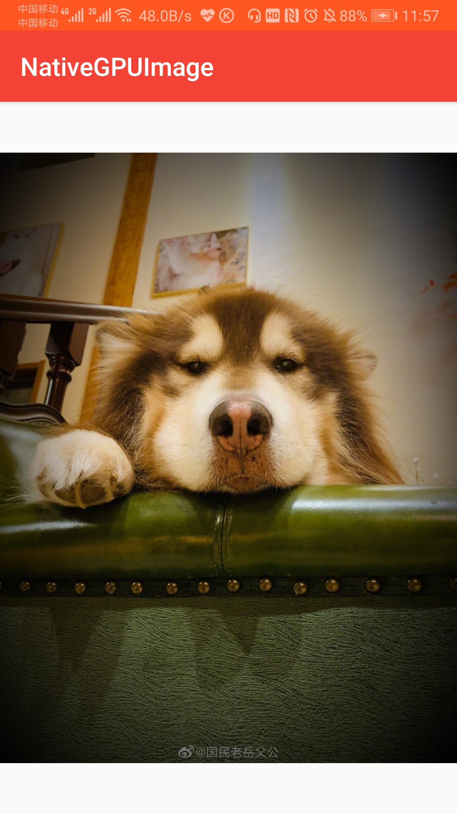

# NativeGPUImage for Android

Idea from: [iOS GPUImage framework](https://github.com/BradLarson/GPUImage2), [android-gpuimage](https://github.com/cats-oss/android-gpuimage)

最近在android直播工程中想要加入滤镜处理，有试过opencv但是使用opencv进行图像处理对cpu造成了很大的压力，以至于礼物动效UI都出现了卡顿。因为需要实时对摄像头采集的数据进行滤镜渲染，最终放弃了opencv的想法改而使用以GPU处理图像的高性能特效gpu-image framework。目前gpuiamge库在android版本中只有java版本，所以本工程是对android-gpuimage的native重写,尽可能的实现android-gpuimage和gpuimage中的特性。


### How do I use NGP?
> 将渲染结果显示在ImageView中.



```
 NGP.with(this)
                .applyBitmapByUrls("http://www.zhangchuany.com/photo5.jpg")
                .applyFilter(new GPUImageSaturationFilter(2.0f)) //设置默认Filter
                .applyWidth(1000)                                //指定宽度渲染，不指定宽度则按原图宽度渲染
                .applyHeight(1000)                               //指定高度渲染，不指定高度则按原图高度渲染
                .applyRotation(Rotation.ROTATION_90)             //旋转90度进行渲染
                .applyScaleType(ScaleType.CENTER_CROP)           //默认 ScaleType.CENTER_INSIDE
                .autoFile(false)                                 //是否将渲染结果保存至磁盘，默认true，设置false将大幅提升NGP响应效率
                .build()
                .into(mImageView)
```

> 如何进行批量FBO渲染
```
 List<Result> results = NGP.with(this)
                       .applyBitmapByUrls(
                               "http://www.zhangchuany.com/photo1.jpg",
                               "http://www.zhangchuany.com/photo2.jpg",
                               "http://www.zhangchuany.com/photo3.jpg",
                               "http://www.zhangchuany.com/photo4.jpg",
                               "http://www.zhangchuany.com/photo5.jpg"
                       )
                       .applyBitmaps(
                               R.drawable.photo1,
                               R.drawable.photo2,
                               R.drawable.photo3,
                               R.drawable.photo4,
                               R.drawable.photo5
                       )
                       .applyFilter(new GPUImageSaturationFilter(2.0f)) //设置默认Filter
                       .applyWidth(1000)                                //指定宽度渲染，不指定宽度则按原图宽度渲染
                       .applyHeight(1000)                               //指定高度渲染，不指定高度则按原图高度渲染
                       .applyRotation(Rotation.ROTATION_90)             //旋转90度进行渲染
                       .applyScaleType(ScaleType.CENTER_CROP)           //默认 ScaleType.CENTER_INSIDE
                       .applyNGPFilter(new NGPFilterListener() {        //设置过滤器，当批量渲染时（非MultipleFilter）
                           @Override
                           public Render.UpgradRender apply(Render.UpgradRender render, int position) {
                               //针对批量处理单独设置filter
                               render.setFilter(filters.get(position));
                               return render;
                           }
                       })
                       .build()
                       .get();                                          //同步处理
```
> Camera实时预览
使用NGPNativeBridge.nativeApplyYUV420(data, width, height)将YUV数据发送至Native进行实时渲染，使用该函数后不需要手动调用NGPNativeBridge.nativeRequestRender()函数。详情见 [CameraDemo](https://github.com/ben622/NativeGPUImage/blob/master/app/src/main/java/com/ben/android/nativegpuimage/CameraActivity.kt)
```
 <com.ben.android.library.NGPSurfaceView
        android:id="@+id/mSurfaceView"
        android:layout_width="match_parent"
        android:layout_height="match_parent"/>
        
```
```
mSurfaceView.initialize({
                    //初始化滤镜
                    NGPNativeBridge.nativeApplyFilter(GPUImageGrayscaleFilter())
                    //设置旋转角度
                    NGPNativeBridge.nativeApplyRotation(Rotation.getValue(getRotation(cameraLoader.getCameraOrientation())), false, false)
                })
```
```
//通过NGPNativeBridge将预览数据发送至Native
NGPNativeBridge.nativeApplyYUV420(data, width, height)
```


> 根据特定场景自定义渲染流程
NGP的渲染是在Native中进行的，与Native的交互都被封装在NGPNativeBridge中，只需要遵循NGPNative生命周期就可以自定义渲染.
```
FBO离屏渲染:
1、NGPNativeBridge.init();                                           //只需执行一次,目的是需要在Native中注册相关Class
2、NGPNativeBridge.nativeCreateGL();                                 //同一个渲染流程只需要创建一次GL
3、NGPNativeBridge.nativeSurfaceChanged(int width, int height);      //当Bitmap宽高发生变化时调用，可以被重复调用
4、NGPNativeBridge.nativeApplyFilter(NativeFilter f);                //设置一个Filter，可以被重复调用
5、NGPNativeBridge.nativeApplyBitmap(Bitmap bitmap);                 //设置一个Bitmap，还未进行渲染
   NGPNativeBridge.nativeApplyYUV420(byte[] yuv);               
6、NGPNativeBridge.nativeCapture(Bitmap bitmap);                     //获取渲染后的Bitmap，渲染.
7、NGPNativeBridge.nativeDestroyed();                                //渲染结束后调用释放资源

Surface渲染:
1、NGPNativeBridge.init(); 
2、NGPNativeBridge.nativeSurfaceCreated(Surface surface);
3、NGPNativeBridge.nativeSurfaceChanged(int width, int height);
4、NGPNativeBridge.nativeApplyFilter(NativeFilter f);
5、NGPNativeBridge.nativeApplyBitmap(Bitmap bitmap);
   NGPNativeBridge.nativeApplyYUV420(byte[] yuv);
6、NGPNativeBridge.nativeRequestRender();
7、NGPNativeBridge.nativeDestorySurfaceGL();
```

### Support status of [GPUImage for iOS](https://github.com/BradLarson/GPUImage2) shaders
- [x] Saturation
- [x] Contrast
- [x] Brightness
- [x] Levels
- [x] Exposure
- [x] RGB
- [x] RGB Diation
- [x] Hue
- [x] White Balance
- [x] Monochrome
- [x] False Color
- [x] Sharpen
- [ ] Unsharp Mask
- [x] Transform Operation
- [ ] Crop
- [x] Gamma
- [x] Highlights and Shadows
- [x] Haze
- [x] Sepia Tone
- [ ] Amatorka
- [ ] Miss Etikate
- [ ] Soft Elegance
- [x] Color Inversion
- [x] Solarize
- [x] Vibrance
- [ ] Highlight and Shadow Tint
- [x] Luminance
- [x] Luminance Threshold
- [ ] Average Color
- [ ] Average Luminance
- [ ] Average Luminance Threshold
- [ ] Adaptive Threshold
- [ ] Polar Pixellate
- [x] Pixellate
- [ ] Polka Dot
- [x] Halftone
- [x] Crosshatch
- [x] Sobel Edge Detection
- [ ] Prewitt Edge Detection
- [ ] Canny Edge Detection
- [x] Threshold Sobel EdgeDetection
- [ ] Harris Corner Detector
- [ ] Noble Corner Detector
- [ ] Shi Tomasi Feature Detector
- [ ] Colour FAST Feature Detector
- [ ] Low Pass Filter
- [ ] High Pass Filter
- [x] Sketch Filter
- [ ] Threshold Sketch Filter
- [x] Toon Filter
- [x] SmoothToon Filter
- [ ] Tilt Shift
- [x] CGA Colorspace Filter
- [x] Posterize
- [x] Convolution 3x3
- [x] Emboss Filter
- [x] Laplacian
- [x] Chroma Keying
- [x] Kuwahara Filter
- [ ] Kuwahara Radius3 Filter
- [x] Vignette
- [x] Gaussian Blur
- [x] Box Blur
- [x] Bilateral Blur
- [ ] Motion Blur
- [x] Zoom Blur
- [ ] iOS Blur
- [ ] Median Filter
- [x] Swirl Distortion
- [x] Bulge Distortion
- [ ] Pinch Distortion
- [x] Sphere Refraction
- [x] Glass Sphere Refraction
- [ ] Stretch Distortion
- [x] Dilation
- [ ] Erosion
- [ ] Opening Filter
- [ ] Closing Filter
- [ ] Local Binary Pattern
- [ ] Color Local Binary Pattern
- [x] Dissolve Blend
- [x] Chroma Key Blend
- [x] Add Blend
- [x] Divide Blend
- [x] Multiply Blend
- [x] Overlay Blend
- [x] Lighten Blend
- [x] Darken Blend
- [x] Color Burn Blend
- [x] Color Dodge Blend
- [x] Linear Burn Blend
- [x] Screen Blend
- [x] Difference Blend
- [x] Subtract Blend
- [x] Exclusion Blend
- [x] HardLight Blend
- [x] SoftLight Blend
- [x] Color Blend
- [x] Hue Blend
- [x] Saturation Blend
- [x] Luminosity Blend
- [x] Normal Blend
- [x] Source Over Blend
- [x] Alpha Blend
- [x] Non Maximum Suppression
- [ ] Thresholded Non Maximum Suppression
- [ ] Directional Non Maximum Suppression
- [x] Opacity
- [x] Weak Pixel Inclusion Filter
- [x] Color Matrix
- [x] Directional Sobel Edge Detection
- [x] Lookup
- [x] Tone Curve (*.acv files) 

## Others
- [x] Texture 3x3
- [x] Gray Scale


## License
    Copyright 2019 ben622, Inc.

    Licensed under the Apache License, Version 2.0 (the "License");
    you may not use this file except in compliance with the License.
    You may obtain a copy of the License at

       http://www.apache.org/licenses/LICENSE-2.0

    Unless required by applicable law or agreed to in writing, software
    distributed under the License is distributed on an "AS IS" BASIS,
    WITHOUT WARRANTIES OR CONDITIONS OF ANY KIND, either express or implied.
    See the License for the specific language governing permissions and
    limitations under the License.
